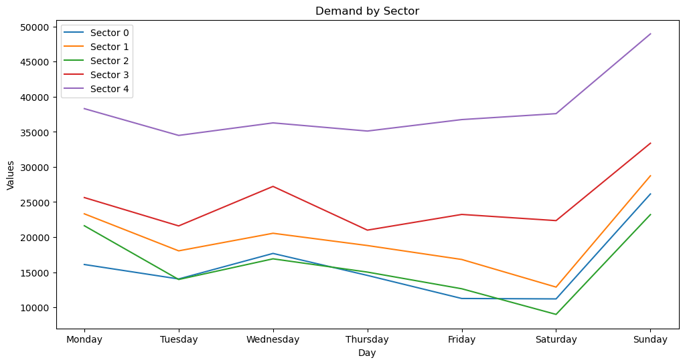

# First problem

## Preparing the environment

We first need to load the documents and libraries we are going to use.


```python
import pandas as pd
import numpy as np
import pyomo
from pyomo.environ import *
import matplotlib.pyplot as plt
from IPython.display import display, HTML
import seaborn as sns
from sklearn.cluster import KMeans
from sklearn.preprocessing import StandardScaler
import random
random.seed(1)
from prettytable import PrettyTable
import plotly.express as px
import plotly.graph_objects as go
import warnings
warnings.simplefilter(action='ignore', category=FutureWarning)
```


```python
demand = pd.read_csv('demand.csv')
demand_printable = pd.read_csv('demand.csv')
cpsector = pd.read_csv('cpsector.csv', index_col=0)
cpsector_printable = pd.read_csv('cpsector.csv', index_col=0)
cpday = pd.read_csv('cpday.csv', index_col=0)
cpday_printable = pd.read_csv('cpday.csv', index_col=0)
mfsector= pd.read_csv('mfsector.csv', index_col=0)
mfsector_printable= pd.read_csv('mfsector.csv', index_col=0)
mfday= pd.read_csv('mfday.csv', index_col=0)
mfday_printable= pd.read_csv('mfday.csv', index_col=0)
```

## Formulation of the problem

## Problem definition

We are going to act as a company of self-service cars. We have used the Shared Cars Locations dataset (https://www.kaggle.com/datasets/gidutz/autotel-shared-car-locations/data) from Kaggle, in which we can track car movement in Tel Aviv. This dataset works by providing the data for cars parked in each parking spot in Tel Aviv every 2 minutes, with their *latitude*, *longitude*, *number of cars parked*, *list of ids of the cars parked* and *timestamp*. We have analysed and cleaned this dataset in a separate file, to obtain the **demand** for cars of this company. We have separated Tel Aviv in 5 different sectors, and distributed the parking sports in them. 

The aim for this project is to optimize the company's decisions to offer the most effective service while maximizing the profit. 

We will optimize the **price** for each sector-day combination, measured in euros. This price establishes the cost per minute of a client using any of our cars. Since the demand is expressed in minutes, we can compute easily the facturation. We will not be focusing on the cost of oil for this project. 


## Formal definition

**Sets:**
* $I = \{1,\ldots, 7\}, \text{Days}$
* $J = \{1,\ldots, 5\}, \text{Sectors}$

**Parameters (demand, competence prices and minimum faturation):**
* $d_{ij}$: expected demand in sector $i$ on day $j$
* $cpsector_{i}$: competence price for a car in sector $i$
* $cpday_{j}$: competence price for a car on day $j$
* $mfsector_{i}$: minimum facturation required in sector $i$
* $mfday_{j}$: minimum facturation required on day $j$
* $higher_{ijk}$: whether the demand on day $i$ in sector $j$ is higher than the demand on day $k$ in sector $j$

**Decision variables:**
* $x_{ijk}$: price for any car located in sector $j$ on day $i$

**Objective function:** maximize the revenue 
$$\max_{\bf{x}} \sum_{j}\sum_{i} p_{ij}d_{ij}$$

**Constraints:**

* The mean price across all sectors for a given day does not surpass the price of the competence for that day.
 $$ \frac{\sum_{i}x_{ij}}{5} \leq ccpday_{j}, \quad \forall j \in J $$

* The mean price across all days for a given sector does not surpass the price of the competence for that sector.
$$ \frac{\sum_{j}x_{ij}}{7} \leq ccpsector_{i}, \quad \forall i \in I $$

* The prices must be higher than 15 cents and lower than 50 cents.
$$ 0.15 \leq x_{ij} \leq 0.5 $$

* Each sector has a minimum facturation requirement which has to be met for the company to be sustainable.
$$ \sum_{j}x_{ij}d_{ij} \geq mfsector_{i}, \quad \forall i \in I $$

* Each day has a minimum facturation requirement which has to be met for the company to be sustainable.
$$ \sum_{i}x_{ij}d_{ij} \geq mfday_{j}, \quad \forall j \in J $$

* If a demand on sector A and day c is higher than the demand on sector B and day c, the price on sector A day c has to be higher than the price on sector B on day c.
$$ \text{higher}_{ijk}x_{ij} - x_{kj} \leq 0, \quad \forall k \in I, \quad k \neq i$$

We have the demand table, which represents the demand for each sector-day combination. We will have this in mind to compute the profit for each day and sector.


```python
demand_printable.index = ['Monday', 'Tuesday', 'Wednesday', 'Thursday', 'Friday', 'Saturday', 'Sunday']
demand_printable.columns = ['Sector 0', 'Sector 1', 'Sector 2', 'Sector 3', 'Sector 4']
demand_printable.head(len(demand_printable))
```


<div>
<style scoped>
    .dataframe tbody tr th:only-of-type {
        vertical-align: middle;
    }

    .dataframe tbody tr th {
        vertical-align: top;
    }

    .dataframe thead th {
        text-align: right;
    }
</style>
<table border="1" class="dataframe">
  <thead>
    <tr style="text-align: right;">
      <th></th>
      <th>Sector 0</th>
      <th>Sector 1</th>
      <th>Sector 2</th>
      <th>Sector 3</th>
      <th>Sector 4</th>
    </tr>
  </thead>
  <tbody>
    <tr>
      <th>Monday</th>
      <td>16093</td>
      <td>23317</td>
      <td>21618</td>
      <td>25635</td>
      <td>38308</td>
    </tr>
    <tr>
      <th>Tuesday</th>
      <td>14033</td>
      <td>18040</td>
      <td>13958</td>
      <td>21594</td>
      <td>34491</td>
    </tr>
    <tr>
      <th>Wednesday</th>
      <td>17672</td>
      <td>20545</td>
      <td>16902</td>
      <td>27223</td>
      <td>36276</td>
    </tr>
    <tr>
      <th>Thursday</th>
      <td>14541</td>
      <td>18798</td>
      <td>15012</td>
      <td>20992</td>
      <td>35114</td>
    </tr>
    <tr>
      <th>Friday</th>
      <td>11250</td>
      <td>16811</td>
      <td>12637</td>
      <td>23229</td>
      <td>36748</td>
    </tr>
    <tr>
      <th>Saturday</th>
      <td>11192</td>
      <td>12874</td>
      <td>8983</td>
      <td>22349</td>
      <td>37594</td>
    </tr>
    <tr>
      <th>Sunday</th>
      <td>26147</td>
      <td>28739</td>
      <td>23207</td>
      <td>33377</td>
      <td>48962</td>
    </tr>
  </tbody>
</table>
</div>


We will define a function that helps us fetch the values for each instance. This function works by specifying the value of the sector (0-4) and the day (Monday=0; Tuesday=1 and so on).


```python
def get_demand(sector, day):
    return demand.iloc[day, sector]
```


```python
# Example
get_demand(0,5)
```


    11192


We also have the prices of the competence for each sector, no matter the day of the week. This will make us be careful about not stablishing abusive prices, because the clients would choose other companies instead.


```python
cpsector.columns = [0,1,2,3,4]
cpsector_printable.head()
```


<div>
<style scoped>
    .dataframe tbody tr th:only-of-type {
        vertical-align: middle;
    }

    .dataframe tbody tr th {
        vertical-align: top;
    }

    .dataframe thead th {
        text-align: right;
    }
</style>
<table border="1" class="dataframe">
  <thead>
    <tr style="text-align: right;">
      <th></th>
      <th>Sector 0</th>
      <th>Sector 1</th>
      <th>Sector 2</th>
      <th>Sector 3</th>
      <th>Sector 4</th>
    </tr>
  </thead>
  <tbody>
    <tr>
      <th>Competence Prices</th>
      <td>0.32</td>
      <td>0.37</td>
      <td>0.33</td>
      <td>0.41</td>
      <td>0.43</td>
    </tr>
  </tbody>
</table>
</div>


Let's also create the function to fetch the values for this table.


```python
def get_cpsector(sector):
    return cpsector.loc["Competence Prices", sector]
```


```python
# Example
get_cpsector(2)
```


    0.33


Next, we have the prices of the competence for each day of the week, which acts in the same way as the table we presented right before.


```python
cpday.index = [0,1,2,3,4,5,6]
cpday_printable.head(7)
```


<div>
<style scoped>
    .dataframe tbody tr th:only-of-type {
        vertical-align: middle;
    }

    .dataframe tbody tr th {
        vertical-align: top;
    }

    .dataframe thead th {
        text-align: right;
    }
</style>
<table border="1" class="dataframe">
  <thead>
    <tr style="text-align: right;">
      <th></th>
      <th>Competence Prices</th>
    </tr>
  </thead>
  <tbody>
    <tr>
      <th>Monday</th>
      <td>0.34</td>
    </tr>
    <tr>
      <th>Tuesday</th>
      <td>0.42</td>
    </tr>
    <tr>
      <th>Wednesday</th>
      <td>0.41</td>
    </tr>
    <tr>
      <th>Thursday</th>
      <td>0.46</td>
    </tr>
    <tr>
      <th>Friday</th>
      <td>0.43</td>
    </tr>
    <tr>
      <th>Saturday</th>
      <td>0.36</td>
    </tr>
    <tr>
      <th>Sunday</th>
      <td>0.39</td>
    </tr>
  </tbody>
</table>
</div>


And the function for this table will be as follows.


```python
day_mapping = {0: 'Monday', 1: 'Tuesday', 2: 'Wednesday', 3: 'Thursday', 4: 'Friday', 5: 'Saturday', 6: 'Sunday'}

def get_cpday(day):
    return cpday.loc[day, 'Competence Prices']
```


```python
# Example
get_cpday(0)
```


    0.34


Let's look at the minimum facturation requirements for each sector:


```python
mfsector.columns = [0, 1, 2, 3, 4]
mfsector_printable.head()
```


<div>
<style scoped>
    .dataframe tbody tr th:only-of-type {
        vertical-align: middle;
    }

    .dataframe tbody tr th {
        vertical-align: top;
    }

    .dataframe thead th {
        text-align: right;
    }
</style>
<table border="1" class="dataframe">
  <thead>
    <tr style="text-align: right;">
      <th></th>
      <th>Sector 0</th>
      <th>Sector 1</th>
      <th>Sector 2</th>
      <th>Sector 3</th>
      <th>Sector 4</th>
    </tr>
  </thead>
  <tbody>
    <tr>
      <th>Minimum Facturation</th>
      <td>31000</td>
      <td>32000</td>
      <td>29000</td>
      <td>33000</td>
      <td>28000</td>
    </tr>
  </tbody>
</table>
</div>


With its correspondent function:


```python
def get_mfsector(sector):
    return mfsector.loc["Minimum Facturation", sector]
```


```python
# Example
get_mfsector(4)
```


    28000


And there are also minimum facturation requirements for each day:


```python
mfday.index = [0, 1, 2, 3, 4, 5, 6]
mfday_printable.head(len(mfday_printable))
```


<div>
<style scoped>
    .dataframe tbody tr th:only-of-type {
        vertical-align: middle;
    }

    .dataframe tbody tr th {
        vertical-align: top;
    }

    .dataframe thead th {
        text-align: right;
    }
</style>
<table border="1" class="dataframe">
  <thead>
    <tr style="text-align: right;">
      <th></th>
      <th>Minimum Facturation</th>
    </tr>
  </thead>
  <tbody>
    <tr>
      <th>Monday</th>
      <td>25000</td>
    </tr>
    <tr>
      <th>Tuesday</th>
      <td>24000</td>
    </tr>
    <tr>
      <th>Wednesday</th>
      <td>26000</td>
    </tr>
    <tr>
      <th>Thursday</th>
      <td>23000</td>
    </tr>
    <tr>
      <th>Friday</th>
      <td>22000</td>
    </tr>
    <tr>
      <th>Saturday</th>
      <td>21000</td>
    </tr>
    <tr>
      <th>Sunday</th>
      <td>27000</td>
    </tr>
  </tbody>
</table>
</div>


Which we can also access through a function:


```python
def get_mfday(day):
    return mfday.loc[day, 'Minimum Facturation']
```


```python
# Example
get_mfday(6)
```


    27000


We will know display all the information we have in a big table, featuring the sectors, days, totals, competence prices and minimum facturation.


```python
whole_table = demand_printable.copy()
whole_table.loc['Total'] = whole_table.sum()
whole_table['Total'] = whole_table.sum(axis=1)
```


```python
whole_table = pd.concat([whole_table, cpday_printable, mfday_printable], axis=1, sort=False)
whole_table = pd.concat([whole_table, cpsector_printable, mfsector_printable], axis=0, sort=False)
whole_table = whole_table.fillna('')
```


```python
whole_table
```


<div>
<style scoped>
    .dataframe tbody tr th:only-of-type {
        vertical-align: middle;
    }

    .dataframe tbody tr th {
        vertical-align: top;
    }

    .dataframe thead th {
        text-align: right;
    }
</style>
<table border="1" class="dataframe">
  <thead>
    <tr style="text-align: right;">
      <th></th>
      <th>Sector 0</th>
      <th>Sector 1</th>
      <th>Sector 2</th>
      <th>Sector 3</th>
      <th>Sector 4</th>
      <th>Total</th>
      <th>Competence Prices</th>
      <th>Minimum Facturation</th>
    </tr>
  </thead>
  <tbody>
    <tr>
      <th>Monday</th>
      <td>16093.00</td>
      <td>23317.00</td>
      <td>21618.00</td>
      <td>25635.00</td>
      <td>38308.00</td>
      <td>124971.0</td>
      <td>0.34</td>
      <td>25000.0</td>
    </tr>
    <tr>
      <th>Tuesday</th>
      <td>14033.00</td>
      <td>18040.00</td>
      <td>13958.00</td>
      <td>21594.00</td>
      <td>34491.00</td>
      <td>102116.0</td>
      <td>0.42</td>
      <td>24000.0</td>
    </tr>
    <tr>
      <th>Wednesday</th>
      <td>17672.00</td>
      <td>20545.00</td>
      <td>16902.00</td>
      <td>27223.00</td>
      <td>36276.00</td>
      <td>118618.0</td>
      <td>0.41</td>
      <td>26000.0</td>
    </tr>
    <tr>
      <th>Thursday</th>
      <td>14541.00</td>
      <td>18798.00</td>
      <td>15012.00</td>
      <td>20992.00</td>
      <td>35114.00</td>
      <td>104457.0</td>
      <td>0.46</td>
      <td>23000.0</td>
    </tr>
    <tr>
      <th>Friday</th>
      <td>11250.00</td>
      <td>16811.00</td>
      <td>12637.00</td>
      <td>23229.00</td>
      <td>36748.00</td>
      <td>100675.0</td>
      <td>0.43</td>
      <td>22000.0</td>
    </tr>
    <tr>
      <th>Saturday</th>
      <td>11192.00</td>
      <td>12874.00</td>
      <td>8983.00</td>
      <td>22349.00</td>
      <td>37594.00</td>
      <td>92992.0</td>
      <td>0.36</td>
      <td>21000.0</td>
    </tr>
    <tr>
      <th>Sunday</th>
      <td>26147.00</td>
      <td>28739.00</td>
      <td>23207.00</td>
      <td>33377.00</td>
      <td>48962.00</td>
      <td>160432.0</td>
      <td>0.39</td>
      <td>27000.0</td>
    </tr>
    <tr>
      <th>Total</th>
      <td>110928.00</td>
      <td>139124.00</td>
      <td>112317.00</td>
      <td>174399.00</td>
      <td>267493.00</td>
      <td>804261.0</td>
      <td></td>
      <td></td>
    </tr>
    <tr>
      <th>Competence Prices</th>
      <td>0.32</td>
      <td>0.37</td>
      <td>0.33</td>
      <td>0.41</td>
      <td>0.43</td>
      <td></td>
      <td></td>
      <td></td>
    </tr>
    <tr>
      <th>Minimum Facturation</th>
      <td>31000.00</td>
      <td>32000.00</td>
      <td>29000.00</td>
      <td>33000.00</td>
      <td>28000.00</td>
      <td></td>
      <td></td>
      <td></td>
    </tr>
  </tbody>
</table>
</div>


We will also compute a table with higher-lower data between sector-day combinations. It is a 5 dimensional array (one dimension for each sector), in which the instances can only take values 1 or 3.34, based on if the demand(i,j) is higher or lower than the demand(k,j), for the same day.


```python
higher = np.zeros((5, 7, 5))

for i in range(5):
    for j in range(7):
        for k in range(5):
            if get_demand(i, j) > get_demand(k,j):
                 higher[i, j, k] = 1
            else:
                higher[i, j, k] = 3.34
```


```python
# Example
print("Demand on sector 3, Friday= ", get_demand(3,4), "\nDemand on sector 2, Friday= ", get_demand(2, 4), 
      "\nValue on table higher for first instance= ", higher[3, 4, 2], 
      "\nValue on table higher for second instance= ", higher[2, 4, 3], 
     "\n\n Since the first value is higher than the second, the first value in higher is 1 and the second is 3,34")
```

    Demand on sector 3, Friday=  23229 
    Demand on sector 2, Friday=  12637 
    Value on table higher for first instance=  1.0 
    Value on table higher for second instance=  3.34 
    
     Since the first value is higher than the second, the first value in higher is 1 and the second is 3,34


## Implementation of the model

Initialize the model


```python
model = ConcreteModel()
model.dual = Suffix(direction=Suffix.IMPORT)
```

### Sets

* $I = \{1,\ldots, 7\}, \text{Days}$
* $J = \{1,\ldots, 5\}, \text{Sectors}$


```python
sectors = range(5)  # Sectors 0 to 4
days = range(7) # Days 0 to 6
```

### Decision variables

$x_{ijk}$: price for any car located in sector $j$ on day $i$


```python
model.x = Var(sectors, days, domain=NonNegativeReals)
```

### Objective function

$$\max_{\bf{x}} \sum_{j}\sum_{i} p_{ij}d_{ij}$$


```python
model.obj = Objective(
    expr=sum(get_demand(sector, day) * model.x[sector, day] for sector in sectors for day in days),
    sense=maximize)
```

### Constraints

The mean price across all days for a given sector does not surpass the price of the competence for that sector.

$$ \frac{\sum_{j}x_{ij}}{7} \leq ccpsector_{i}, \quad \forall i \in I $$


```python
model.pricesector0 = Constraint(expr= (sum(model.x[0, day] for day in days)/7) <= get_cpsector(0))
model.pricesector1 = Constraint(expr= (sum(model.x[1, day] for day in days)/7) <= get_cpsector(1))
model.pricesector2 = Constraint(expr= (sum(model.x[2, day] for day in days)/7) <= get_cpsector(2))
model.pricesector3 = Constraint(expr= (sum(model.x[3, day] for day in days)/7) <= get_cpsector(3))
model.pricesector4 = Constraint(expr= (sum(model.x[4, day] for day in days)/7) <= get_cpsector(4))
```

The mean price across all sectors for a given day does not surpass the price of the competence for that day.

 $$ \frac{\sum_{i}x_{ij}}{5} \leq ccpday_{j}, \quad \forall j \in J $$


```python
model.pricemonday = Constraint(expr= (sum(model.x[sector, 0] for sector in sectors)/5) <= get_cpday(0))
model.pricetuesday = Constraint(expr= (sum(model.x[sector, 1] for sector in sectors)/5) <= get_cpday(1))
model.pricewednesday = Constraint(expr= (sum(model.x[sector, 2] for sector in sectors)/5) <= get_cpday(2))  
model.pricethursday = Constraint(expr= (sum(model.x[sector, 3] for sector in sectors)/5) <= get_cpday(3))                        
model.pricefriday = Constraint(expr= (sum(model.x[sector, 4] for sector in sectors)/5) <= get_cpday(4))
model.pricesaturday = Constraint(expr= (sum(model.x[sector, 5] for sector in sectors)/5) <= get_cpday(5))                         
model.pricesunday = Constraint(expr= (sum(model.x[sector, 6] for sector in sectors)/5) <= get_cpday(6))
```

Each sector has a minimum facturation requirement which has to be met for the company to be sustainable.

$$ \sum_{j}x_{ij}d_{ij} \geq mfsector_{i}, \quad \forall i \in I $$


```python
model.minimumfacturationsector0 = Constraint(expr=sum(model.x[0, day] * get_demand(0, day) for day in days) >= get_mfsector(0))
model.minimumfacturationsector1 = Constraint(expr=sum(model.x[1, day] * get_demand(1, day) for day in days) >= get_mfsector(1))
model.minimumfacturationsector2 = Constraint(expr=sum(model.x[2, day] * get_demand(2, day) for day in days) >= get_mfsector(2))
model.minimumfacturationsector3 = Constraint(expr=sum(model.x[3, day] * get_demand(3, day) for day in days) >= get_mfsector(3))
model.minimumfacturationsector4 = Constraint(expr=sum(model.x[4, day] * get_demand(4, day) for day in days) >= get_mfsector(4))
```

Each day has a minimum facturation requirement which has to be met for the company to be sustainable.

$$ \sum_{i}x_{ij}d_{ij} \geq mfday_{j}, \quad \forall j \in J $$


```python
model.minimumfacturationmonday = Constraint(expr= sum(model.x[sector, 0]*get_demand(sector, 0) for sector in sectors) >= get_mfday(0))
model.minimumfacturationtuesday = Constraint(expr= sum(model.x[sector, 1]*get_demand(sector, 1) for sector in sectors) >= get_mfday(1))
model.minimumfacturationwednesday = Constraint(expr= sum(model.x[sector, 2]*get_demand(sector, 2) for sector in sectors) >= get_mfday(2))  
model.minimumfacturationthursday = Constraint(expr= sum(model.x[sector, 3]*get_demand(sector, 3) for sector in sectors) >= get_mfday(3))                        
model.minimumfacturationfriday = Constraint(expr= sum(model.x[sector, 4]*get_demand(sector, 4) for sector in sectors) >= get_mfday(4))
model.minimumfacturationsaturday = Constraint(expr= sum(model.x[sector, 5]*get_demand(sector, 5) for sector in sectors) >= get_mfday(5))                         
model.minimumfacturationsunday = Constraint(expr= sum(model.x[sector, 6]*get_demand(sector, 6) for sector in sectors) >= get_mfday(6))
```

The prices must be higher than 15 cents and lower than 50 cents.

$$ 0.15 \leq x_{ij} \leq 0.5 $$


```python
for i in range(5):
    for j in range(7):
        constraint_name = f'higherthan15_{i}_{j}'
        model.add_component(constraint_name, Constraint(expr=model.x[i, j] >= 0.15))
```


```python
for i in range(5):
    for j in range(7):
        constraint_name = f'lowerthan50_{i}_{j}'
        model.add_component(constraint_name, Constraint(expr=model.x[i, j] <= 0.5))
```

If a demand on sector A and day c is higher than the demand on sector B and day c, the price on sector A day c has to be higher than the price on sector B on day c.

$$ \text{higher}_{ijk}x_{ij} - x_{kj} \leq 0, \quad \forall k \in I, \quad k \neq i$$


```python
def higherDemand(model, i, j, r):
    constraint_value = higher[i, j, r] * model.x[i, j] - model.x[r, j]
    return constraint_value >= -1e-6
```


```python
model.higherdemandhigherprice= Constraint(sectors, days, sectors, rule=higherDemand)
```

### Initialize the solver and solve the model


```python
solver = SolverFactory('gurobi')
solver.solve(model)
```


    {'Problem': [{'Name': 'x1', 'Lower bound': 315831.48600950005, 'Upper bound': 315831.48600950005, 'Number of objectives': 1, 'Number of constraints': 269, 'Number of variables': 35, 'Number of binary variables': 0, 'Number of integer variables': 0, 'Number of continuous variables': 35, 'Number of nonzeros': 525, 'Sense': 'maximize'}], 'Solver': [{'Status': 'ok', 'Return code': '0', 'Message': 'Model was solved to optimality (subject to tolerances), and an optimal solution is available.', 'Termination condition': 'optimal', 'Termination message': 'Model was solved to optimality (subject to tolerances), and an optimal solution is available.', 'Wall time': '0.0010001659393310547', 'Error rc': 0, 'Time': 0.32898879051208496}], 'Solution': [OrderedDict([('number of solutions', 0), ('number of solutions displayed', 0)])]}


## Interpreting the solution

Here we have the solution obtained by the model:


```python
for sector in sectors:
    for day in days:
        dayprint = day_mapping.get(day, None)
        print(f"Price of cars on {dayprint} in Sector {sector}: {model.x[sector, day].value}")

# Print the total revenue
print(f"Total revenue: {model.obj()}")
```

    Price of cars on Monday in Sector 0: 0.15
    Price of cars on Tuesday in Sector 0: 0.4200005999999999
    Price of cars on Wednesday in Sector 0: 0.4100004
    Price of cars on Thursday in Sector 0: 0.4600006
    Price of cars on Friday in Sector 0: 0.20399680000000067
    Price of cars on Saturday in Sector 0: 0.15
    Price of cars on Sunday in Sector 0: 0.44600159999999994
    Price of cars on Monday in Sector 1: 0.3875005
    Price of cars on Tuesday in Sector 1: 0.4199995999999999
    Price of cars on Wednesday in Sector 1: 0.40999939999999996
    Price of cars on Thursday in Sector 1: 0.4599996
    Price of cars on Friday in Sector 1: 0.31650030000000023
    Price of cars on Saturday in Sector 1: 0.15
    Price of cars on Sunday in Sector 1: 0.44600059999999997
    Price of cars on Monday in Sector 2: 0.3875005
    Price of cars on Tuesday in Sector 2: 0.4200006
    Price of cars on Wednesday in Sector 2: 0.4100004
    Price of cars on Thursday in Sector 2: 0.46000059999999987
    Price of cars on Friday in Sector 2: 0.3165013000000002
    Price of cars on Saturday in Sector 2: 0.15
    Price of cars on Sunday in Sector 2: 0.1659966000000003
    Price of cars on Monday in Sector 3: 0.38749950000000005
    Price of cars on Tuesday in Sector 3: 0.4199995999999999
    Price of cars on Wednesday in Sector 3: 0.4100004
    Price of cars on Thursday in Sector 3: 0.4599995999999999
    Price of cars on Friday in Sector 3: 0.5
    Price of cars on Saturday in Sector 3: 0.24650029999999992
    Price of cars on Sunday in Sector 3: 0.44600059999999997
    Price of cars on Monday in Sector 4: 0.38749950000000005
    Price of cars on Tuesday in Sector 4: 0.4199995999999999
    Price of cars on Wednesday in Sector 4: 0.4099994
    Price of cars on Thursday in Sector 4: 0.4599995999999999
    Price of cars on Friday in Sector 4: 0.499999
    Price of cars on Saturday in Sector 4: 0.38650230000000035
    Price of cars on Sunday in Sector 4: 0.44600059999999997
    Total revenue: 315831.48600950005


Which we will display with a more clear version in a table


```python
results = {
    "Monday": [model.x[sector, 0].value for sector in range(5)],
    "Tuesday": [model.x[sector, 1].value for sector in range(5)],
    "Wednesday": [model.x[sector, 2].value for sector in range(5)],
    "Thursday": [model.x[sector, 3].value for sector in range(5)],
    "Friday": [model.x[sector, 4].value for sector in range(5)],
    "Saturday": [model.x[sector, 5].value for sector in range(5)],
    "Sunday": [model.x[sector, 6].value for sector in range(5)],
}

results = pd.DataFrame(results)
results= pd.DataFrame.transpose(results)
results_printable = results.copy()
results.index = [0, 1, 2, 3, 4, 5, 6]
results_printable.columns = ['Sector 0', 'Sector 1', 'Sector 2', 'Sector 3', 'Sector 4']
results_printable = results_printable.round(2)
results_printable
```


<div>
<style scoped>
    .dataframe tbody tr th:only-of-type {
        vertical-align: middle;
    }

    .dataframe tbody tr th {
        vertical-align: top;
    }

    .dataframe thead th {
        text-align: right;
    }
</style>
<table border="1" class="dataframe">
  <thead>
    <tr style="text-align: right;">
      <th></th>
      <th>Sector 0</th>
      <th>Sector 1</th>
      <th>Sector 2</th>
      <th>Sector 3</th>
      <th>Sector 4</th>
    </tr>
  </thead>
  <tbody>
    <tr>
      <th>Monday</th>
      <td>0.15</td>
      <td>0.39</td>
      <td>0.39</td>
      <td>0.39</td>
      <td>0.39</td>
    </tr>
    <tr>
      <th>Tuesday</th>
      <td>0.42</td>
      <td>0.42</td>
      <td>0.42</td>
      <td>0.42</td>
      <td>0.42</td>
    </tr>
    <tr>
      <th>Wednesday</th>
      <td>0.41</td>
      <td>0.41</td>
      <td>0.41</td>
      <td>0.41</td>
      <td>0.41</td>
    </tr>
    <tr>
      <th>Thursday</th>
      <td>0.46</td>
      <td>0.46</td>
      <td>0.46</td>
      <td>0.46</td>
      <td>0.46</td>
    </tr>
    <tr>
      <th>Friday</th>
      <td>0.20</td>
      <td>0.32</td>
      <td>0.32</td>
      <td>0.50</td>
      <td>0.50</td>
    </tr>
    <tr>
      <th>Saturday</th>
      <td>0.15</td>
      <td>0.15</td>
      <td>0.15</td>
      <td>0.25</td>
      <td>0.39</td>
    </tr>
    <tr>
      <th>Sunday</th>
      <td>0.45</td>
      <td>0.45</td>
      <td>0.17</td>
      <td>0.45</td>
      <td>0.45</td>
    </tr>
  </tbody>
</table>
</div>


We will print also the facturation for each sector


```python
print("Facturation for each sector: \n", (results_printable * demand_printable).sum(), "\n")
print("Facturation for each day: \n", (results_printable * demand_printable).sum(axis=1))
```

    Facturation for each sector: 
     Sector 0     37937.14
    Sector 1     53984.13
    Sector 2     37465.20
    Sector 3     72106.28
    Sector 4    115520.50
    dtype: float64 
    
    Facturation for each day: 
     Monday       44876.37
    Tuesday      42888.72
    Wednesday    48633.38
    Thursday     48050.22
    Friday       41661.86
    Saturday     25206.26
    Sunday       65696.44
    dtype: float64


### Plots

Let's see the plots for the demand and price for the different sectors across the different days of the week. In this plot we can see that the highest demand belongs to sector 4, then sector 3, then sector 1 and finally sector 0 and 2 are interchangeably getting last place. When looking at the second plot (in which we used less opacity to better see the results, we see that this order is somewhat still present, which we stablished in one of our constraints. The only destacable thing is that the prices for sector 1 and 2 follow a very similar pattern.


```python
results_days, results_values = results_printable.index, results_printable.values.astype(float)
demand_days, demand_values = demand_printable.index, demand_printable.values.astype(int)

plt.figure(figsize=(12, 6))

for sector, values in enumerate(demand_values.T):
    plt.plot(demand_days, values, label=f'Sector {sector}', alpha=1)

plt.title('Demand by Sector')
plt.xlabel('Day')
plt.ylabel('Values')
plt.legend()
plt.show()

plt.figure(figsize=(12, 6))

for sector, values in enumerate(results_values.T):
    plt.plot(results_days, values, label=f'Sector {sector}', alpha=0.5)

plt.title('Results by Sector')
plt.xlabel('Day')
plt.ylabel('Values')
plt.legend()
plt.show()
```


    

    


    

    


In the following plot we just printed both graphs on top of each other to show the relationship between the prices and the demands together.


```python
results_days, results_values = results_printable.index, results_printable.values.astype(float)
demand_days, demand_values = demand_printable.index, demand_printable.values.astype(int)
colors = ['blue', 'orange', 'green', 'red', 'purple']

# Plotting results and demand
plt.figure(figsize=(12, 6))

for sector, (result_values, demand_values) in enumerate(zip(results_values.T, demand_values.T)):
    # Plot results
    plt.plot(results_days, result_values, label=f'Sector {sector} - Results', color=colors[sector], alpha=0.5, linestyle='--')

    # Plot demand (scaled for better visibility)
    plt.plot(demand_days, demand_values / 100000, label=f'Sector {sector} - Demand', color=colors[sector], alpha=1)

plt.title('Results and Demand by Sector')
plt.xlabel('Day')
plt.yticks([])
plt.legend()
plt.show()
```


    

    


And finally from the following plot we see the different relationships between price and demand for the different sectors. Here what we can study as interesting is that the prices somewhat resemble the demand distributions, although they do not perfectly follow them because of the rest of the constraints. In the last plot, we have displayed the mean for demand and price for all sectors, which gives an insight about how the model tried to follow the demand distribution to stablish the prices. Of course, in the other plots, we see that this was not possible in every instance because of all the other constraints, which also imposed other criteria to meet.


```python
results_days, results_values = results_printable.index, results_printable.values.astype(float)
demand_days, demand_values = demand_printable.index, demand_printable.values.astype(int)
colors = ['blue', 'orange', 'green', 'red', 'purple']
num_sectors = len(sectors)

fig, axes = plt.subplots(3, 2, figsize=(12, 10), sharex=True)
axes = axes.flatten()

for sector, ax in enumerate(axes):
    if sector < num_sectors: 
        ax.plot(results_days, results_values[:, sector], label=f'Sector {sector} - Results', color=colors[sector], linestyle='--', alpha=0.5)
        ax.plot(demand_days, demand_values[:, sector] / 100002, label=f'Sector {sector} - Demand', color=colors[sector], alpha=1)
        ax.set_title(f'Sector {sector}')
    else:
        ax.plot(results_days, np.mean(results_values, axis=1), label='Mean Results', color='black', linestyle='--', alpha=0.5)
        ax.plot(demand_days, np.mean(demand_values, axis=1) / 100002, label='Mean Demand', color='black', alpha=1)
        ax.set_title('Mean for all sectors')

fig.suptitle('Results and Demand by Sector', y=1.02)
plt.xlabel('Day')
fig.legend(loc='upper right', bbox_to_anchor=(1.1, 1.05))
plt.tight_layout()
plt.show()
```


    

    


## Sensitivities in our problem

We will now see the sensitivities of out constraints. We will separate them in groups.


```python
dual_values = {}

for constraint in model.component_data_objects(Constraint, active=True):
    dual_values[constraint] = model.dual[constraint]
```

#### Price per sector constraints


```python
for i, (constraint, dual_value) in enumerate(dual_values.items()):
    if i < 5:
        print(f"Dual value for constraint {constraint}: {dual_value}")
```

    Dual value for constraint pricesector0: 78750.0
    Dual value for constraint pricesector1: 127394.40000000002
    Dual value for constraint pricesector2: 78741.59999999998
    Dual value for constraint pricesector3: 156443.0
    Dual value for constraint pricesector4: 263158.0


We see from this all sectors were affected by this constraint, that means, a change in 1 unit in the competence price for each sector would make a difference in the result of the model.

#### Price per day contraints


```python
for i, (constraint, dual_value) in enumerate(dual_values.items()):
    if 4 < i < 12:
        print(f"Dual value for constraint {constraint}: {dual_value}")
```

    Dual value for constraint pricemonday: 24358.749999999996
    Dual value for constraint pricetuesday: 1475.0
    Dual value for constraint pricewednesday: 17977.000000000004
    Dual value for constraint pricethursday: 3816.0000000000014
    Dual value for constraint pricefriday: 0.0
    Dual value for constraint pricesaturday: 0.0
    Dual value for constraint pricesunday: 59791.0


This constraint does not affect the prices on Friday nor Saturday. However, the other days are affected, ones more highly than others.

#### Minimum facturation per sector contraints


```python
for i, (constraint, dual_value) in enumerate(dual_values.items()):
    if 11 < i < 17:
        print(f"Dual value for constraint {constraint}: {dual_value}")
```

    Dual value for constraint minimumfacturationsector0: 0.0
    Dual value for constraint minimumfacturationsector1: 0.0
    Dual value for constraint minimumfacturationsector2: 0.0
    Dual value for constraint minimumfacturationsector3: 0.0
    Dual value for constraint minimumfacturationsector4: 0.0


We can clearly see that the minimum facturation constraint is not important to get the solutions for our model, given it does not have any influence.

#### Minimum facturation per day contraints


```python
for i, (constraint, dual_value) in enumerate(dual_values.items()):
    if 16 < i < 24:
        print(f"Dual value for constraint {constraint}: {dual_value}")
```

    Dual value for constraint minimumfacturationmonday: 0.0
    Dual value for constraint minimumfacturationtuesday: 0.0
    Dual value for constraint minimumfacturationwednesday: 0.0
    Dual value for constraint minimumfacturationthursday: 0.0
    Dual value for constraint minimumfacturationfriday: 0.0
    Dual value for constraint minimumfacturationsaturday: 0.0
    Dual value for constraint minimumfacturationsunday: 0.0


The same happens with the price for each day. A possible explanation is that our values for minimum facturation are too low for our model, or that the price for the competence was too rigid and had too much influence on it.

#### Higher than constraints


```python
for i, (constraint, dual_value) in enumerate(dual_values.items()):
    if 23 < i < 59:
        print(f"Dual value for constraint {constraint}: {dual_value}")
```

    Dual value for constraint higherthan15_0_0: -28.75
    Dual value for constraint higherthan15_0_1: 0.0
    Dual value for constraint higherthan15_0_2: 0.0
    Dual value for constraint higherthan15_0_3: 0.0
    Dual value for constraint higherthan15_0_4: 0.0
    Dual value for constraint higherthan15_0_5: -58.0
    Dual value for constraint higherthan15_0_6: 0.0
    Dual value for constraint higherthan15_1_0: 0.0
    Dual value for constraint higherthan15_1_1: 0.0
    Dual value for constraint higherthan15_1_2: 0.0
    Dual value for constraint higherthan15_1_3: 0.0
    Dual value for constraint higherthan15_1_4: 0.0
    Dual value for constraint higherthan15_1_5: -5325.200000000001
    Dual value for constraint higherthan15_1_6: 0.0
    Dual value for constraint higherthan15_2_0: 0.0
    Dual value for constraint higherthan15_2_1: 0.0
    Dual value for constraint higherthan15_2_2: 0.0
    Dual value for constraint higherthan15_2_3: 0.0
    Dual value for constraint higherthan15_2_4: 0.0
    Dual value for constraint higherthan15_2_5: -2265.7999999999956
    Dual value for constraint higherthan15_2_6: 0.0
    Dual value for constraint higherthan15_3_0: 0.0
    Dual value for constraint higherthan15_3_1: 0.0
    Dual value for constraint higherthan15_3_2: 0.0
    Dual value for constraint higherthan15_3_3: 0.0
    Dual value for constraint higherthan15_3_4: 0.0
    Dual value for constraint higherthan15_3_5: 0.0
    Dual value for constraint higherthan15_3_6: 0.0
    Dual value for constraint higherthan15_4_0: 0.0
    Dual value for constraint higherthan15_4_1: 0.0
    Dual value for constraint higherthan15_4_2: 0.0
    Dual value for constraint higherthan15_4_3: 0.0
    Dual value for constraint higherthan15_4_4: 0.0
    Dual value for constraint higherthan15_4_5: 0.0
    Dual value for constraint higherthan15_4_6: 0.0


We see here that the sensitivities have had an impact in the model. This could be explained by the model giving prices to satisfy the other constraints without necessarily following the demand. Since we imposed that the demand distribution had to be somewhat correspondent to the price results, we see that it has had an impact in the solution. However, a lot of these constraint sensitivities are different from zero. The effect of these sentivities can be seen in the table, given that a lot of our price values are more than 0.15. For those that are exactly 0.15, we can see their values here.

#### Lower than 50 cents constraints


```python
for i, (constraint, dual_value) in enumerate(dual_values.items()):
    if 58 < i < 94:
        print(f"Dual value for constraint {constraint}: {dual_value}")
```

    Dual value for constraint lowerthan50_0_0: 0.0
    Dual value for constraint lowerthan50_0_1: 0.0
    Dual value for constraint lowerthan50_0_2: 0.0
    Dual value for constraint lowerthan50_0_3: 0.0
    Dual value for constraint lowerthan50_0_4: 0.0
    Dual value for constraint lowerthan50_0_5: 0.0
    Dual value for constraint lowerthan50_0_6: 0.0
    Dual value for constraint lowerthan50_1_0: 0.0
    Dual value for constraint lowerthan50_1_1: 0.0
    Dual value for constraint lowerthan50_1_2: 0.0
    Dual value for constraint lowerthan50_1_3: 0.0
    Dual value for constraint lowerthan50_1_4: 0.0
    Dual value for constraint lowerthan50_1_5: 0.0
    Dual value for constraint lowerthan50_1_6: 0.0
    Dual value for constraint lowerthan50_2_0: 0.0
    Dual value for constraint lowerthan50_2_1: 0.0
    Dual value for constraint lowerthan50_2_2: 0.0
    Dual value for constraint lowerthan50_2_3: 0.0
    Dual value for constraint lowerthan50_2_4: 0.0
    Dual value for constraint lowerthan50_2_5: 0.0
    Dual value for constraint lowerthan50_2_6: 0.0
    Dual value for constraint lowerthan50_3_0: 0.0
    Dual value for constraint lowerthan50_3_1: 0.0
    Dual value for constraint lowerthan50_3_2: 0.0
    Dual value for constraint lowerthan50_3_3: 0.0
    Dual value for constraint lowerthan50_3_4: 34.0
    Dual value for constraint lowerthan50_3_5: 0.0
    Dual value for constraint lowerthan50_3_6: 0.0
    Dual value for constraint lowerthan50_4_0: 0.0
    Dual value for constraint lowerthan50_4_1: 0.0
    Dual value for constraint lowerthan50_4_2: 0.0
    Dual value for constraint lowerthan50_4_3: 0.0
    Dual value for constraint lowerthan50_4_4: 0.0
    Dual value for constraint lowerthan50_4_5: 0.0
    Dual value for constraint lowerthan50_4_6: 0.0


This shows that 1 value would be higher than 50 cents if we had not imposed this constraint. If we look again at the results, there is just one price that is exactly 50 cents, and that is the price that are different from zero in the sensitivities. The other price that is 0.50 in the tables is shown as 4.99 in the results.

#### Higher demand contraints


```python
for i, (constraint, dual_value) in enumerate(dual_values.items()):
    if 93 < i:
        print(f"Dual value for constraint {constraint}: {dual_value}")
```

    Dual value for constraint higherdemandhigherprice[0,0,0]: 0.0
    Dual value for constraint higherdemandhigherprice[0,0,1]: 0.0
    Dual value for constraint higherdemandhigherprice[0,0,2]: 0.0
    Dual value for constraint higherdemandhigherprice[0,0,3]: 0.0
    Dual value for constraint higherdemandhigherprice[0,0,4]: 0.0
    Dual value for constraint higherdemandhigherprice[0,1,0]: 0.0
    Dual value for constraint higherdemandhigherprice[0,1,1]: 0.0
    Dual value for constraint higherdemandhigherprice[0,1,2]: 0.0
    Dual value for constraint higherdemandhigherprice[0,1,3]: 0.0
    Dual value for constraint higherdemandhigherprice[0,1,4]: 0.0
    Dual value for constraint higherdemandhigherprice[0,2,0]: 0.0
    Dual value for constraint higherdemandhigherprice[0,2,1]: 0.0
    Dual value for constraint higherdemandhigherprice[0,2,2]: 0.0
    Dual value for constraint higherdemandhigherprice[0,2,3]: 0.0
    Dual value for constraint higherdemandhigherprice[0,2,4]: 0.0
    Dual value for constraint higherdemandhigherprice[0,3,0]: 0.0
    Dual value for constraint higherdemandhigherprice[0,3,1]: 0.0
    Dual value for constraint higherdemandhigherprice[0,3,2]: 0.0
    Dual value for constraint higherdemandhigherprice[0,3,3]: 0.0
    Dual value for constraint higherdemandhigherprice[0,3,4]: 0.0
    Dual value for constraint higherdemandhigherprice[0,4,0]: 0.0
    Dual value for constraint higherdemandhigherprice[0,4,1]: 0.0
    Dual value for constraint higherdemandhigherprice[0,4,2]: 0.0
    Dual value for constraint higherdemandhigherprice[0,4,3]: 0.0
    Dual value for constraint higherdemandhigherprice[0,4,4]: 0.0
    Dual value for constraint higherdemandhigherprice[0,5,0]: 0.0
    Dual value for constraint higherdemandhigherprice[0,5,1]: 0.0
    Dual value for constraint higherdemandhigherprice[0,5,2]: 0.0
    Dual value for constraint higherdemandhigherprice[0,5,3]: 0.0
    Dual value for constraint higherdemandhigherprice[0,5,4]: 0.0
    Dual value for constraint higherdemandhigherprice[0,6,0]: 0.0
    Dual value for constraint higherdemandhigherprice[0,6,1]: 0.0
    Dual value for constraint higherdemandhigherprice[0,6,2]: 0.0
    Dual value for constraint higherdemandhigherprice[0,6,3]: 0.0
    Dual value for constraint higherdemandhigherprice[0,6,4]: 0.0
    Dual value for constraint higherdemandhigherprice[1,0,0]: 0.0
    Dual value for constraint higherdemandhigherprice[1,0,1]: 0.0
    Dual value for constraint higherdemandhigherprice[1,0,2]: 0.0
    Dual value for constraint higherdemandhigherprice[1,0,3]: 0.0
    Dual value for constraint higherdemandhigherprice[1,0,4]: 0.0
    Dual value for constraint higherdemandhigherprice[1,1,0]: -454.2000000000007
    Dual value for constraint higherdemandhigherprice[1,1,1]: 0.0
    Dual value for constraint higherdemandhigherprice[1,1,2]: 0.0
    Dual value for constraint higherdemandhigherprice[1,1,3]: 0.0
    Dual value for constraint higherdemandhigherprice[1,1,4]: 0.0
    Dual value for constraint higherdemandhigherprice[1,2,0]: -1249.600000000003
    Dual value for constraint higherdemandhigherprice[1,2,1]: 0.0
    Dual value for constraint higherdemandhigherprice[1,2,2]: 0.0
    Dual value for constraint higherdemandhigherprice[1,2,3]: 0.0
    Dual value for constraint higherdemandhigherprice[1,2,4]: 0.0
    Dual value for constraint higherdemandhigherprice[1,3,0]: -164.400000000001
    Dual value for constraint higherdemandhigherprice[1,3,1]: 0.0
    Dual value for constraint higherdemandhigherprice[1,3,2]: 0.0
    Dual value for constraint higherdemandhigherprice[1,3,3]: 0.0
    Dual value for constraint higherdemandhigherprice[1,3,4]: 0.0
    Dual value for constraint higherdemandhigherprice[1,4,0]: 0.0
    Dual value for constraint higherdemandhigherprice[1,4,1]: 0.0
    Dual value for constraint higherdemandhigherprice[1,4,2]: -1388.2000000000044
    Dual value for constraint higherdemandhigherprice[1,4,3]: 0.0
    Dual value for constraint higherdemandhigherprice[1,4,4]: 0.0
    Dual value for constraint higherdemandhigherprice[1,5,0]: 0.0
    Dual value for constraint higherdemandhigherprice[1,5,1]: 0.0
    Dual value for constraint higherdemandhigherprice[1,5,2]: 0.0
    Dual value for constraint higherdemandhigherprice[1,5,3]: 0.0
    Dual value for constraint higherdemandhigherprice[1,5,4]: 0.0
    Dual value for constraint higherdemandhigherprice[1,6,0]: -1418.3999999999942
    Dual value for constraint higherdemandhigherprice[1,6,1]: 0.0
    Dual value for constraint higherdemandhigherprice[1,6,2]: 0.0
    Dual value for constraint higherdemandhigherprice[1,6,3]: 0.0
    Dual value for constraint higherdemandhigherprice[1,6,4]: 0.0
    Dual value for constraint higherdemandhigherprice[2,0,0]: 0.0
    Dual value for constraint higherdemandhigherprice[2,0,1]: 0.0
    Dual value for constraint higherdemandhigherprice[2,0,2]: 0.0
    Dual value for constraint higherdemandhigherprice[2,0,3]: 0.0
    Dual value for constraint higherdemandhigherprice[2,0,4]: 0.0
    Dual value for constraint higherdemandhigherprice[2,1,0]: 0.0
    Dual value for constraint higherdemandhigherprice[2,1,1]: 0.0
    Dual value for constraint higherdemandhigherprice[2,1,2]: 0.0
    Dual value for constraint higherdemandhigherprice[2,1,3]: 0.0
    Dual value for constraint higherdemandhigherprice[2,1,4]: 0.0
    Dual value for constraint higherdemandhigherprice[2,2,0]: 0.0
    Dual value for constraint higherdemandhigherprice[2,2,1]: 0.0
    Dual value for constraint higherdemandhigherprice[2,2,2]: 0.0
    Dual value for constraint higherdemandhigherprice[2,2,3]: 0.0
    Dual value for constraint higherdemandhigherprice[2,2,4]: 0.0
    Dual value for constraint higherdemandhigherprice[2,3,0]: 0.0
    Dual value for constraint higherdemandhigherprice[2,3,1]: 0.0
    Dual value for constraint higherdemandhigherprice[2,3,2]: 0.0
    Dual value for constraint higherdemandhigherprice[2,3,3]: 0.0
    Dual value for constraint higherdemandhigherprice[2,3,4]: 0.0
    Dual value for constraint higherdemandhigherprice[2,4,0]: 0.0
    Dual value for constraint higherdemandhigherprice[2,4,1]: 0.0
    Dual value for constraint higherdemandhigherprice[2,4,2]: 0.0
    Dual value for constraint higherdemandhigherprice[2,4,3]: 0.0
    Dual value for constraint higherdemandhigherprice[2,4,4]: 0.0
    Dual value for constraint higherdemandhigherprice[2,5,0]: 0.0
    Dual value for constraint higherdemandhigherprice[2,5,1]: 0.0
    Dual value for constraint higherdemandhigherprice[2,5,2]: 0.0
    Dual value for constraint higherdemandhigherprice[2,5,3]: 0.0
    Dual value for constraint higherdemandhigherprice[2,5,4]: 0.0
    Dual value for constraint higherdemandhigherprice[2,6,0]: 0.0
    Dual value for constraint higherdemandhigherprice[2,6,1]: 0.0
    Dual value for constraint higherdemandhigherprice[2,6,2]: 0.0
    Dual value for constraint higherdemandhigherprice[2,6,3]: 0.0
    Dual value for constraint higherdemandhigherprice[2,6,4]: 0.0
    Dual value for constraint higherdemandhigherprice[3,0,0]: 0.0
    Dual value for constraint higherdemandhigherprice[3,0,1]: 0.0
    Dual value for constraint higherdemandhigherprice[3,0,2]: -1585.749999999999
    Dual value for constraint higherdemandhigherprice[3,0,3]: 0.0
    Dual value for constraint higherdemandhigherprice[3,0,4]: 0.0
    Dual value for constraint higherdemandhigherprice[3,1,0]: -1050.0
    Dual value for constraint higherdemandhigherprice[3,1,1]: 0.0
    Dual value for constraint higherdemandhigherprice[3,1,2]: 0.0
    Dual value for constraint higherdemandhigherprice[3,1,3]: 0.0
    Dual value for constraint higherdemandhigherprice[3,1,4]: 0.0
    Dual value for constraint higherdemandhigherprice[3,2,0]: 0.0
    Dual value for constraint higherdemandhigherprice[3,2,1]: 0.0
    Dual value for constraint higherdemandhigherprice[3,2,2]: 0.0
    Dual value for constraint higherdemandhigherprice[3,2,3]: 0.0
    Dual value for constraint higherdemandhigherprice[3,2,4]: 0.0
    Dual value for constraint higherdemandhigherprice[3,3,0]: 0.0
    Dual value for constraint higherdemandhigherprice[3,3,1]: 0.0
    Dual value for constraint higherdemandhigherprice[3,3,2]: -2120.2000000000003
    Dual value for constraint higherdemandhigherprice[3,3,3]: 0.0
    Dual value for constraint higherdemandhigherprice[3,3,4]: 0.0
    Dual value for constraint higherdemandhigherprice[3,4,0]: 0.0
    Dual value for constraint higherdemandhigherprice[3,4,1]: 0.0
    Dual value for constraint higherdemandhigherprice[3,4,2]: 0.0
    Dual value for constraint higherdemandhigherprice[3,4,3]: 0.0
    Dual value for constraint higherdemandhigherprice[3,4,4]: 0.0
    Dual value for constraint higherdemandhigherprice[3,5,0]: 0.0
    Dual value for constraint higherdemandhigherprice[3,5,1]: 0.0
    Dual value for constraint higherdemandhigherprice[3,5,2]: 0.0
    Dual value for constraint higherdemandhigherprice[3,5,3]: 0.0
    Dual value for constraint higherdemandhigherprice[3,5,4]: 0.0
    Dual value for constraint higherdemandhigherprice[3,6,0]: -930.2000000000007
    Dual value for constraint higherdemandhigherprice[3,6,1]: 0.0
    Dual value for constraint higherdemandhigherprice[3,6,2]: 0.0
    Dual value for constraint higherdemandhigherprice[3,6,3]: 0.0
    Dual value for constraint higherdemandhigherprice[3,6,4]: 0.0
    Dual value for constraint higherdemandhigherprice[4,0,0]: 0.0
    Dual value for constraint higherdemandhigherprice[4,0,1]: -246.04999999999927
    Dual value for constraint higherdemandhigherprice[4,0,2]: -3911.7
    Dual value for constraint higherdemandhigherprice[4,0,3]: 0.0
    Dual value for constraint higherdemandhigherprice[4,0,4]: 0.0
    Dual value for constraint higherdemandhigherprice[4,1,0]: -983.7999999999992
    Dual value for constraint higherdemandhigherprice[4,1,1]: 0.0
    Dual value for constraint higherdemandhigherprice[4,1,2]: -2414.2000000000007
    Dual value for constraint higherdemandhigherprice[4,1,3]: 0.0
    Dual value for constraint higherdemandhigherprice[4,1,4]: 0.0
    Dual value for constraint higherdemandhigherprice[4,2,0]: -1577.0
    Dual value for constraint higherdemandhigherprice[4,2,1]: 0.0
    Dual value for constraint higherdemandhigherprice[4,2,2]: -2057.800000000002
    Dual value for constraint higherdemandhigherprice[4,2,3]: -1278.599999999999
    Dual value for constraint higherdemandhigherprice[4,2,4]: 0.0
    Dual value for constraint higherdemandhigherprice[4,3,0]: -2363.3999999999987
    Dual value for constraint higherdemandhigherprice[4,3,1]: 0.0
    Dual value for constraint higherdemandhigherprice[4,3,2]: -879.8000000000038
    Dual value for constraint higherdemandhigherprice[4,3,3]: 0.0
    Dual value for constraint higherdemandhigherprice[4,3,4]: 0.0
    Dual value for constraint higherdemandhigherprice[4,4,0]: 0.0
    Dual value for constraint higherdemandhigherprice[4,4,1]: 0.0
    Dual value for constraint higherdemandhigherprice[4,4,2]: 0.0
    Dual value for constraint higherdemandhigherprice[4,4,3]: -846.0
    Dual value for constraint higherdemandhigherprice[4,4,4]: 0.0
    Dual value for constraint higherdemandhigherprice[4,5,0]: 0.0
    Dual value for constraint higherdemandhigherprice[4,5,1]: 0.0
    Dual value for constraint higherdemandhigherprice[4,5,2]: 0.0
    Dual value for constraint higherdemandhigherprice[4,5,3]: 0.0
    Dual value for constraint higherdemandhigherprice[4,5,4]: 0.0
    Dual value for constraint higherdemandhigherprice[4,6,0]: -590.2000000000007
    Dual value for constraint higherdemandhigherprice[4,6,1]: 0.0
    Dual value for constraint higherdemandhigherprice[4,6,2]: 0.0
    Dual value for constraint higherdemandhigherprice[4,6,3]: 0.0
    Dual value for constraint higherdemandhigherprice[4,6,4]: 0.0


We see that these constraints also have had an effect on the model, which means that some prices were decided based on some demand factors. Although many of these values are zero, we can argue that this was an important constraint because of the number of non-zero values. We also had a lot of different constraints alltogether, which maybe made this constraint be met in any case for some of this combinations, without having to apply the constraint necessarily.

### Conclusions about the sensitivities


```python
counter=0
for i, (constraint, dual_value) in enumerate(dual_values.items()):
    if dual_value!=0:
        counter+=1
counter
```


    35


We have found 35 constraints that have had an effect on our model. Since we iterated through a lot of combinations, we got an initial amount of 269 constraints (displayed when we solved the model), but not all of them were important when stablishing the prices of our sector-day car combinations. This is because some of the constraints were very tight to meet and had a greater impact than the looser constraints, that were fulfilled without any extra computations. 

# Second problem (Binary part)

## Formulation of the problem

## Problem definition

To ensure a high-quality service for the clients, each car from a fleet of 100 cars must undergo a scheduled maintenance service once a week. This maintenance check verifies that each car functions correctly and identifies any potential damages. As in the previous part, the pricing for the car-sharing service varies on a daily basis and across different sectors.

We encounter two constraints in this optimization process:

* Workshop Capacity: The workshop dedicated to car maintenance has a finite daily capacity, limiting the number of cars that can undergo maintenance each day. Specifically, the maximum capacity is set at 20 cars per day.

* Sector Demand: Beyond the cars undergoing maintenance, the remaining vehicles in the fleet need to be allocated strategically. This allocation must be done in a manner that aligns with the demand for each sector on a given day.

Our goal is to obtain an efficient maintenance schedule and car allocation that optimally balances workshop capacity and sector-specific demands while maximizing the obtained revenue.


## Formal definition

**Sets:**
* $I = \{1,\ldots, 7\}, \text{Days}$
* $J = \{1,\ldots, 5\}, \text{Sectors}$
* $K = \{1,\ldots, 100\}, \text{Cars}$

**Parameters:**
* $d_{ij}$: demand on a ceratin day $i$ in a certain sector $j$
* $c_{ij}$: price per minute for a car $k$ on day $i$ in sector $j$, even though the objective function is not informative in this case, it serves the purpose of maximizing the whole revenue

**Decision variables:**
* $x_{ijk}$: whether car $k$ is located in sector $j$ on day $i$
* $y_{ik}$: whether car $k$ undergoes maintenance on day $i$

**Objective function:** maximize the revenue 
$$\max_{\bf{x}} \sum_{i} \sum_{j} \sum_{k} c_{ij}x_{ijk}$$

**Constraints:**

* A maximum of 20 cars can undergo maintenance on one day in the workshop
$$\sum_{k}y_{ik}<=20, \forall i\in I$$

* A demand for each day and sector has to be accomplished
$$\sum_k x_{ijk} >= Demand_{ij}, \forall j\in J, \forall i \in I$$

* A car has to undergo maintenance just one time every week
$$\sum_i y_{ik} = 1, \forall k\in K$$

* A car cannot be allocated if it undergoes maintenance that same day
$$x_{ijk} <= 1-y_{ik}, \forall i\in I, \forall j\in J, \forall k\in K$$

* A car cannot be allocated in another sector if it is already allocated that same day
$$\sum_{j}x_{ijk} <= 1, \forall i\in I, \forall k \in K$$

## Data

It can be helpful to see what are the data we are working with

### Demand

The demands are estimated from the original dataset based on the first 100 cars' indices, that is why we can see that proportionally this demands can vary from the ones used in the previous part


```python
demand_binary_part = pd.read_csv('demand_binary_part.csv', index_col=0)
demand_binary_part_printable = demand_binary_part
demand_binary_part_printable.index = ['Monday', 'Tuesday', 'Wednesday', 'Thursday', 'Friday', 'Saturday', 'Sunday']
demand_binary_part_printable.columns = ['Sector 0', 'Sector 1', 'Sector 2', 'Sector 3', 'Sector 4']

demand_binary_part
```


<div>
<style scoped>
    .dataframe tbody tr th:only-of-type {
        vertical-align: middle;
    }

    .dataframe tbody tr th {
        vertical-align: top;
    }

    .dataframe thead th {
        text-align: right;
    }
</style>
<table border="1" class="dataframe">
  <thead>
    <tr style="text-align: right;">
      <th></th>
      <th>Sector 0</th>
      <th>Sector 1</th>
      <th>Sector 2</th>
      <th>Sector 3</th>
      <th>Sector 4</th>
    </tr>
  </thead>
  <tbody>
    <tr>
      <th>Monday</th>
      <td>22</td>
      <td>11</td>
      <td>8</td>
      <td>12</td>
      <td>12</td>
    </tr>
    <tr>
      <th>Tuesday</th>
      <td>23</td>
      <td>8</td>
      <td>7</td>
      <td>15</td>
      <td>14</td>
    </tr>
    <tr>
      <th>Wednesday</th>
      <td>23</td>
      <td>9</td>
      <td>8</td>
      <td>15</td>
      <td>14</td>
    </tr>
    <tr>
      <th>Thursday</th>
      <td>26</td>
      <td>10</td>
      <td>8</td>
      <td>18</td>
      <td>15</td>
    </tr>
    <tr>
      <th>Friday</th>
      <td>25</td>
      <td>10</td>
      <td>6</td>
      <td>15</td>
      <td>17</td>
    </tr>
    <tr>
      <th>Saturday</th>
      <td>27</td>
      <td>4</td>
      <td>6</td>
      <td>8</td>
      <td>18</td>
    </tr>
    <tr>
      <th>Sunday</th>
      <td>24</td>
      <td>8</td>
      <td>9</td>
      <td>13</td>
      <td>15</td>
    </tr>
  </tbody>
</table>
</div>


### Prices (cost)

As we have said, we will used the prices optimized in the previous part in this part as the cost in our objective function. Although the objective value does not inform us of how much revenue we obtain, using the prices as the cost ensures that we are maximizing the revenue.


```python
results_printable
```


<div>
<style scoped>
    .dataframe tbody tr th:only-of-type {
        vertical-align: middle;
    }

    .dataframe tbody tr th {
        vertical-align: top;
    }

    .dataframe thead th {
        text-align: right;
    }
</style>
<table border="1" class="dataframe">
  <thead>
    <tr style="text-align: right;">
      <th></th>
      <th>Sector 0</th>
      <th>Sector 1</th>
      <th>Sector 2</th>
      <th>Sector 3</th>
      <th>Sector 4</th>
    </tr>
  </thead>
  <tbody>
    <tr>
      <th>Monday</th>
      <td>0.15</td>
      <td>0.39</td>
      <td>0.39</td>
      <td>0.39</td>
      <td>0.39</td>
    </tr>
    <tr>
      <th>Tuesday</th>
      <td>0.42</td>
      <td>0.42</td>
      <td>0.42</td>
      <td>0.42</td>
      <td>0.42</td>
    </tr>
    <tr>
      <th>Wednesday</th>
      <td>0.41</td>
      <td>0.41</td>
      <td>0.41</td>
      <td>0.41</td>
      <td>0.41</td>
    </tr>
    <tr>
      <th>Thursday</th>
      <td>0.46</td>
      <td>0.46</td>
      <td>0.46</td>
      <td>0.46</td>
      <td>0.46</td>
    </tr>
    <tr>
      <th>Friday</th>
      <td>0.20</td>
      <td>0.32</td>
      <td>0.32</td>
      <td>0.50</td>
      <td>0.50</td>
    </tr>
    <tr>
      <th>Saturday</th>
      <td>0.15</td>
      <td>0.15</td>
      <td>0.15</td>
      <td>0.25</td>
      <td>0.39</td>
    </tr>
    <tr>
      <th>Sunday</th>
      <td>0.45</td>
      <td>0.45</td>
      <td>0.17</td>
      <td>0.45</td>
      <td>0.45</td>
    </tr>
  </tbody>
</table>
</div>


## Sets, Parameters and Decision variables

Define our sets $I$ (days), $J$ (sectors) and $K$ (cars) and we will assign them a descriptive name for convenience


```python
days = range(0, 7) # Number of days
sectors = range(0, 5) # Number of sectors
cars = range(0, 100) # Number of cars

model = ConcreteModel()

model.days = Set(initialize=days, doc='Days')
model.sectors = Set(initialize=sectors, doc='Sectors')
model.cars = Set(initialize=cars, doc='Cars')
```

Now we will assign **prices** for in sector on each day which are those optimized in the previous part, they will be our costs: $c_{ij}$


```python
prices = {(i, j): np.asarray(results)[i,j] for i in days for j in sectors}
model.prices = Param(model.days, model.sectors, initialize=prices, doc='Prices')
```

Then we will assing a **demand** that must be accomplished in each sector on each day, this demand is estimated from the original carsharing dataset: $Demand_{ij}$


```python
demand = {(i,j): np.asarray(demand_binary_part)[i,j] for i in days for j in sectors}
model.demand = Param(model.days, model.sectors, initialize=demand, doc='Demand')
```

Now we will define our **location** variable $x_{ijk}$ and **maintenance** variable $y_{ik}$ which are both binary variables


```python
model.x = Var(model.days, model.sectors, model.cars, within=Binary)  # Location variable x_ijk
model.y = Var(model.days, model.cars, within=Binary) # Maintenance variable y_ik
```

## Objective function
Define our objetive function: $$\max_{\bf{x}} \sum_{i} \sum_{j} \sum_{k} c_{ij}x_{ijk}$$


```python
model.obj = Objective(expr=sum(model.prices[i, j] * model.x[i, j, k] for i in model.days for j in model.sectors for k in model.cars), sense=maximize)
```

## Constraints 
---
Define the constraint that limits the maximum number of car on maintenance per day to 20: $$\sum_{k}y_{ik}<=20, \forall i\in I$$


```python
model.max_cars_per_day = ConstraintList()
for i in model.days:
    model.max_cars_per_day.add(sum(model.y[i, k] for k in model.cars) <= 20)
```

---
Define the constraint that sets a minimum demand for each sector on each day: $$\sum_k x_{ijk} >= Demand_{ij}, \forall j\in J, \forall i \in I$$


```python
model.demand_constraint = ConstraintList()
for i in days:
    for j in sectors:
        model.demand_constraint.add(sum(model.x[i, j, k] for k in cars) >= model.demand[i,j])
```

---
Define the constraint that specifies that each car has to undergo maintenance once a week:
$$\sum_i y_{ik} = 1, \forall k\in K$$


```python
model.maintenance_constraint = ConstraintList()
for k in model.cars:
    model.maintenance_constraint.add(sum(model.y[i, k] for i in model.days) == 1 )
```

---
Define the constraint that specifies that a car cannot be allocated if it undergoes maintenance that day:
$$x_{ijk} <= 1-y_{ik}, \forall i\in I, \forall j\in J, \forall k\in K$$


```python
model.logic_constraint_maintenance = ConstraintList()
for i in model.days:
    for j in model.sectors:
        for k in model.cars:
            model.logic_constraint_maintenance.add(model.x[i,j,k]<=1-model.y[i,k])
```

---
Define the constraint that specifies if a car is allocated in a sector in cannot be allocated in another sector that same day:
$$\sum_{j}x_{ijk} <= 1, \forall i\in I, \forall k \in K$$


```python
model.logic_constraint_location = ConstraintList()
for i in model.days:
        for k in model.cars:
            model.logic_constraint_location.add(sum(model.x[i,j,k] for j in model.sectors) <= 1)
```

## Solve the model

Now we solve the model using the *gurobi* solver


```python
# Insert your code here
Solver = SolverFactory('gurobi')
results = Solver.solve(model)
```

## Conclusions

Finally we will plot the results and extract conclusions.


```python
result_data = []
for i in days:
    for j in sectors:
        for k in cars:
            result_data.append({
                'Day': i,
                'Sector': j,
                'Car': k,
                'Location': value(model.x[i, j, k]),
                'Maintenance': value(model.y[i, k])
            })
    
    
# Create a DataFrame
results_df = pd.DataFrame(result_data)

```


```python
print(results_df)
```

          Day  Sector  Car  Location  Maintenance
    0       0       0    0      -0.0         -0.0
    1       0       0    1      -0.0         -0.0
    2       0       0    2      -0.0          1.0
    3       0       0    3      -0.0          0.0
    4       0       0    4      -0.0          0.0
    ...   ...     ...  ...       ...          ...
    3495    6       4   95       1.0         -0.0
    3496    6       4   96       1.0         -0.0
    3497    6       4   97       1.0          0.0
    3498    6       4   98       1.0         -0.0
    3499    6       4   99       0.0         -0.0
    
    [3500 rows x 5 columns]


```python
pivot_location = results_df.pivot_table(values='Location', index='Car', columns=['Day', 'Sector'])

# Plot the heatmap
plt.figure(figsize=(12, 8))
sns.heatmap(pivot_location, cmap=['red', 'green'], cbar_kws={'label': 'Location'}, linewidths=0.5, linecolor='black')
plt.title('Car Location on Each Day in Each Sector')
plt.show()
```


    

    


In this graph we can see how the allocation of cars is distributed optimally meeting each demand and respecting the constraints


```python
pivot_maintenance = results_df.pivot_table(values='Maintenance', index='Car', columns='Day')

# Plot the heatmap
plt.figure(figsize=(12, 8))
sns.heatmap(pivot_maintenance, cmap=['red', 'green'], cbar_kws={'label': 'Maintenance'}, linewidths=0.5, linecolor='black')
plt.title('Car Maintenance on Each Day')
plt.show()
```


    

    


Now we can see how each car undergoies maintenance in such a way the cut in revenue is minimized, again respecting the constraint of maximum 20 cars per day

Overall, visually, we can see that the optimization problem is solved correctly by checking:

* That each car undergoes maintenance at least once a week

* The demand of each day in each sector is satisfied

* Comparing the demand and price data to the obtained results we can see that the cars seem to be allocated properly

Finally we will also plot some lineplots in order to see the relations between the parameters and the results


```python
plt.figure(figsize=(16, 10))

# Plot Prices
plt.subplot(2, 2, 1)
sns.lineplot(data=[[prices[i, j] for i in days] for j in sectors], markers=True)
plt.title('Prices on Each Day and Sector')
plt.xlabel('Day')
plt.ylabel('Price')

# Plot Demand
plt.subplot(2, 2, 2)
sns.lineplot(data=demand_binary_part, markers=True)
plt.title('Demand on Each Day and Sector')
plt.xlabel('Day')
plt.ylabel('Demand')

plt.tight_layout()
plt.show()
```


    

    


```python
pivot_location = results_df.pivot_table(values='Location', index='Car', columns=['Sector', 'Day'])
# Line plot for the count of cars located
plt.figure(figsize=(16, 10))

plt.subplot(2,2,1)
for j in sectors:
    plt.plot(days, pivot_location[j].sum(), label=f'Sector {j}')
plt.xlabel('Day')
plt.ylabel('Car Count')
plt.title('Cars Location Over Sectors and Days')
plt.legend()

# Line plot for the count of cars under maintenance
plt.subplot(2,2,2)
plt.plot(days, pivot_maintenance.sum(), label=f'No. of cars undergoing maintenance')
plt.xlabel('Day')
plt.ylabel('Car Count')
plt.title('Cars Undergoing Maintenance Over Days')
plt.legend()
plt.show()

```


    

    


From these graphs we can clearly see how the allocation of cars meet the demand and how de maintenance of the cars is distributed in such a way that we get a nice balance between price and demand in such a way that we maximize the revenue and comparing the price and demand graphs we can see how they are combined in the cars allocation graph.

